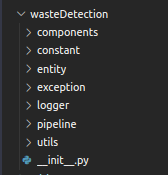
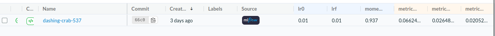
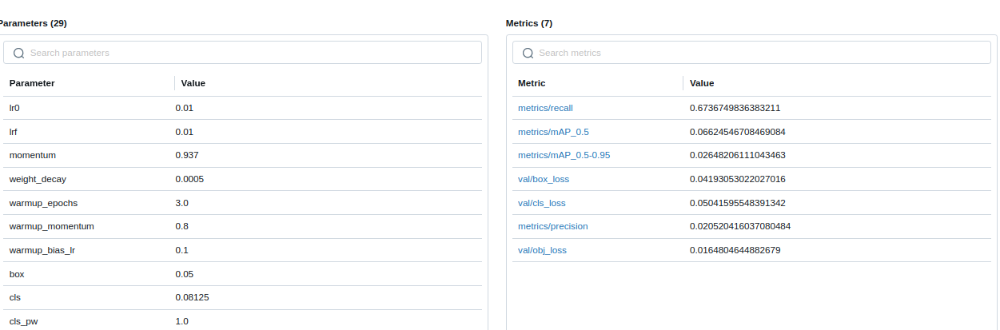

# DL-End2End

This repository encapsulates a comprehensive deep learning workflow, guiding you from raw data collection to deploying a fully trained model on the cloud. The project integrates essential components such as data version control, MLFlow for experiment tracking, and Docker for containerization, making it a robust and scalable solution for real-world deep learning applications.

## Key Features
* Logging and Exception Handling
* Modular Coding
* MLFlow - Experiment Tracking
* DVC - Data Version Control
* Flask - Web App
* Docker and AWS for Cloud Deployment

<details>
  <summary><b>Run the App</b></summary>

* <b>Clone the repository</b>
 
    ``` https://github.com/Mohit-robo/end-to-end-deployment.git```

* <b>Create a virtual environment</b> 

    ```
    ### Conda env
    conda create -n waste python=3.7 -y
    conda activate waste

    ### Virtual env
    python3 -m venv waste
    
    source waste/bin/activate ## linux
    waste/Scripts/activate ## Windows

    ```
* <b>Install Requirements</b> 

    ``` pip install -r requirements.txt```

* <b>Run the App</b>
    
    ``` python app.py```

    open up your local host and port mentioned in the script.
    
    ``` localhost:8080```
  
</details>

## **Step by Step Implementation**

### **Step 1: Installation and Setup**

#### **Create a virtual environment**
    
    ### Conda env
    conda create -n waste python=3.7 -y
    conda activate waste

    ### Virtual env
    python3 -m venv waste
    
    source waste/bin/activate ## linux
    waste/Scripts/activate ## Windows

#### **Install Requirements**

    pip install -r requirements.txt

### **Step 2: Data Gathering**

The URL to the dataset is mentioned in the configs in this [file](wasteDetection/constant/training_pipeline/__init__.py). You can change the URL to your dataset incsae you want to use another custom dataset

### **Logging and Exception Handling**

This project incorporates robust logging and exception handling to ensure smooth and traceable execution. Logging provides detailed insights into the workflow by capturing key events, errors, and system states, which aids in debugging and monitoring the application's performance. Exception handling mechanisms are in place to gracefully manage unexpected errors, preventing the application from crashing and ensuring that issues are logged for future analysis. This approach enhances the reliability and maintainability of the entire pipeline.

### **Step 3: Coding**

The directory structure is as shown below:



Run the ```template.py``` script to automatically create all the required files and folders. Refer to all the files from this repo and test the files individually. 

#### **MLFlow Integration: A Tool for Managing the Machine Learning Lifecycle**

This project leverages MLFlow integrated with DagsHub for efficient experiment tracking, model versioning, and collaboration. By using DagsHub as the remote repository for MLFlow artifacts, you can seamlessly track your experiments, store model artifacts, and visualize performance metrics all in one place. This integration ensures that every aspect of your machine learning pipeline is version-controlled and easily accessible, enhancing reproducibility and collaboration within the team.

Once you set up DagsHub profile, link your current github repo to DagsHub. In the `wasteDetection/constant/training_pipeline/__init__.py` change the `GITHUB_USER_NAME`, `GITHUB_REPO_NAME` and `MLFLOW_TRACKING_URI`.

#### **Model Training**

Refer to this [file](wasteDetection/constant/training_pipeline/__init__.py), this contains the configs.

    python wasteDetection/pipeline/training_pipeline.py

Run the above command to train the object detector model. Check the `artifacts/model_trainer/`  folder, the final weights file will be save here.  

Now you can check the MLFlow experiment, the DagsHub page would show something such 



Also you can log hyperparams, to compare multiple experiments incase to figure out the best performing combination of hyperparams.


#### **DVC**

DVC is a tool for version control of data and models. It is used to track the changes in the files or hyperparams. One of the many advantages of DVC is not running the entire pipeline if the step is been performed previously. DVC checks the cache and executes the part of the pipeline not executed previously.

    dvc init
    dvc repro

Now that we have DVC integrated, you can directly run the entire pipeline with dvc commands.

### **Step 4: Testing Flask App Locally**

1. Run the Flask App locally


        python app.py

2. Open a browser and host ip and the port on which the app is runnig. In our case:

        localhost:8080

    This open a page that directs to the `prediction` page. 

3. Incase if you want to access the webcam, open 

        localhost:8080/live

    This will access the webcam

4. Incase if you don't have a model trained, open:  

        localhost:8080/train

